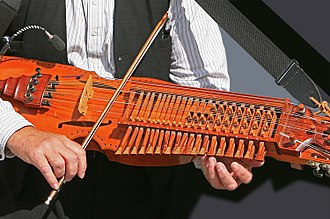

# Nyckelharpa
  
**The buttons and levers controlling Hubitat Elevation's Home Security Monitor's strings.** 
## Table of Contents 
[&ensp;1. Purpose](#purpose) 
[&ensp;2. Features](#features) 
[&ensp;3. Donate](#support) 
[&ensp;4. Installation](#install) 
[&ensp;5. Quick Setup Guide](#setup) 
[&ensp;6. Global Settings](#globals) 
[&ensp;7. Forced Arming, Adjust HSM Settings](#adjustHSM) 
[&ensp;8. Modefix Setup and Usage](#modefix) 
[&ensp;9. Talker messages](#talker) 
[10. Keypad Device Handler](#keypadDH) 
[11. User/Pin Profiles](#userpin) 
[12. Debugging](#testing) 
[13. Get Help, report an issue, or contact information](#help)

## 1. Purpose
Nyckepharpa is a user created Hubitat Home Security Monitor (HSM) extension, providing features not available in HSM. Additionally, it simplifies setting up security related messaging. 

[:arrow_up_small: Back to top](#top)

## 2. Features

* Under user control, forces HSM arming when a contact is open.  
Why is this needed? HSM does not arm the system when a contact is open. Examples: It's 1AM, you want to arm the system for night, but a contact is broken.  You are away from home, forgot to arm the system, and when you try, oops the back door is open. 
* Adjusts Hubitat's mode when HSM's arm state changes. (HSM adjusts HSM's arm state when the mode changes)
* Provides an easy to use security related message control center with output to TTS, Speakers, and Pushover

* Keypads: Centralite V2 and V3, Iris V2, and UEI(beta) devices may use a ported version of Mitch Pond's Keypad DH making he keypad function as it did in SmartThings with the SHM Delay App, and it uses an easy to use Pin maintenance module with available use count, time. and devices restrictions.
* When Panic is issued using the ported version of Mitch Pond's keypad with the Nyckelharpa app:  
When system is armed: triggers instant intrusion 
When system is disarmed: attempts to arm system then issues an intrusion

[:arrow_up_small: Back to top](#top)

## 3. Support this project
This app is free and very much beta code. However, if you like it, derived benefit from it, and want to express your support, donations are appreciated.
* Paypal: https://www.paypal.me/arnbme 

[:arrow_up_small: Back to top](#top)

## 4. Installation

There are four modules and an optional Keypad Device Handler (DH) associated with this app  
 <table style="width:100%">
  <tr>
    <th>Module Name</th>
    <th>Function</th>
    <th>Required</th>
  </tr>
  <tr>
    <td>Nyckelharpa</td>
    <td>Parent module. Controls HSM forced arming from a keypad, and User pin verification</td>
    <td>Yes</td>
  </tr>
  <tr>
    <td>Nyckelharpa Modefix</td>
    <td>Adjusts HSM mode when HSM State changes, and forced arming from a non keypd source</td>
    <td>Yes</td>
  </tr>
  <tr>
    <td>Nyckelharpa Talker</td>
    <td>Creates security related output to TTS, speakers, Pushover</td>
    <td>Optional</td>
  </tr>
  <tr>
    <td>Nyckelharpa User</td>
    <td>Maintains User pin codes when using the app's Centralite Keypad DH</td>
    <td>Optional</td>
  </tr>
  <tr>
    <td>Centralite Keypad</td>
    <td>Keypad device handler for models: Centralite V2 and V3, Iris V2, and UEI(beta). Created and converted to HE by Mitch Pond</td>
    <td>Optional</td>
  </tr>
</table> 

* Using the link below, let's begin by installing the Nyckelharpa parent module into Hubitat (HE) from this Github repository.  OAuth is not required and should be skipped.  Should you want to used the Install's Import button each module's Github raw address is availabe at the beginning of the module. 
https://docs.hubitat.com/index.php?title=How_to_Install_Custom_Apps  
Then then install Modefix, Talker, Contact and User, ignore OAuth, and do not add these modules as User Apps.

* Should you be using the user Centralite Keypad driver follow these directions 
https://docs.hubitat.com/index.php?title=How_to_Install_Custom_Drivers

*  Next step: Quick Setup Guide

[:arrow_up_small: Back to top](#top)

## 5. Quick Setup Guide
Detailed instuctions for each step follow the Quick Setup Guide. Begin by clicking on APPs in the HE menu, then click on Nyckelharpa
1. Setup [Global Settings](#globals), then click Next, then Done.

2. Setup [Forced Arming, Adjust HSM's settings](#adjustHSM) 
3. Create [the Required Modefix profile](#modefix)
4. Optionally create a [Talker profile](#talker)
5. Optionally set a one or more existing keypad devices to use the user provided [Centralite Driver](#keypadDH), then add one or more [User pin profiles](#userpin) 

[:arrow_up_small: Back to top](#top)

## 6. Global Settings. Includes preparation information needed for Forced HSM Arming.

Global Settings is reached by: clicking Apps in the menu, then click the Nyckelharpa app, scroll down to Global Settings, then click  "click to show" 
1. Select any keypad devices using the Nyckelharpa provided Centralite Keypad device driver
* When devices are selected, default options for valid and invalid pin message routing are shown

2. <b>Prepare for Forced Arming:</b> <i>For each armState</i> select real contact sensor devices that will allow HSM arming when the device is Open.
* _When Global Settings is saved, each selectd contact generates a child Virtual Contact Sensor named NCKL-contact-sensor-name that must be used to Adjust HSM Settings for Forced HSM Arming
* Specify optional destinations for "arming canceled contact open" and "arming forced messages: Pushover, SMS, Talk. No destinations: these messages are not generated
3. Select any contact to be monitored for Open / Close Talker messages only, that are not used with Forced HSM Arming

4. Select any alarms and beeps as required
5. Set the Virtual Child Device prefix, Default NCKL. Once set, it displays but cannot be changed.

6. Set any Pushover messaging devices

7. *When finished, click Next, then click Done*

[:arrow_up_small: Back to top](#top)

## 7. Forced Arming, Adjust HSM Settings.

Forced Arming is a two step process: An standard initial HSM arming that fails normally, followed by a second arming within 15 seconds that forces HSM to arm. It works from any arming source, including: keypads, locks, dashboards, and the HSM app

1. Required Basic Setup: 
* Follow instrucions in Section 6 above, generating the NCKL-child-contact-sensors, and the NCKL-Panic Contact 

2. Setup HSM's devices for Forced Arming: 
* In Intrusion-Away, Intrusion-Home, and Intrusion-Night, "Contact Sensors": replace the real contact-sensor-name(s) with the virtual NCKL-contact-sensor-name(s), and add the NCKL-Panic-Contact
* In "Configure/Arming/Disarming/Cancel Options", "Delay only for selected doors": replace the real contact-sensor-name(s) with the virtual NCKL-contact-sensor-name(s)

3. How to Force Arm, a two step process: Arming that fails normally, then Arming again within 15 seconds
* Arm system as you would normally. When there is an open contact sensor monitored by Nyckelharpa, the system will not arm as is normal for HSM
* At the initial arm fail: any defined keypads beep twice, Talker issues an alert message including the open sensor(s) and the 15 second forced rearm time 
* Arming the system again, after a minimum of 3 seconds, to a maximum of 15 seconds from the initial arming failure, forces the HSM system to Arm
  
[:arrow_up_small: Back to top](#top)

## 8. Modefix setup and usage

Modefix processes HSM armState changes, and optionally sets the Hubitat HSM mode. _It must be created even when the optional mode change data is empty._ 

(Optional) For each armState set:
* all valid modes for the armState
* the default mode for the armState

Caution: improper armState/mode choices, creates havoc with the system.

[:arrow_up_small: Back to top](#top)

## 9. Talker messages

Table with Reason Issued and Message Issued. 
* Pin messages, arming canceled, and arming forced, do not allow for text adjustment. 
* Messages not displayed in this table, such as Intrusion Alerts, are generated by HSM.
 <table style="width:100%">
  <tr>
    <th>Reason Issued</th>
    <th>Default Message</th>
   <th>Issueing Module</th> 
  </tr>
  <tr>
    <td>Contact Sensor Opens, arm state disarmed</td>
    <td>%device is now open</td>
   <td>Nyckelharpa</td>
  </tr>
  <tr>
    <td>Contact Sensor Closes, arm state disarmed</td>
   <td>%device is now closed</td>
   <td>Nyckelharpa</td>
 </tr>
  <tr>
    <td>Exit Delay</td>
    <td>Alarm system is arming in %nn seconds. Please exit the facility</td>
   <td>Nyckelharpa Modefix</td>
  </tr>
  <tr>
    <td>Entry Delay</td>
    <td>Please enter your pin on the keypad</td>
   <td>Nyckelharpa</td>
  </tr>
  <tr>
    <td>System Armed</td>
    <td>Alarm System is now armed in %hsmStatus Mode</td>
   <td>Nyckelharpa Modefix</td>
  </tr>
  <tr>
    <td>System Disarmed</td>
    <td>System Disarmed</td>
   <td>Nyckelharpa Modefix</td>
  </tr>
  <tr>
    <td>Valid Pin Entered</td>
    <td>%keypad.displayname set HSM state to %armState with pin for %userName</td>
    <td>Nyckelharpa</td>
  </tr> 
  <tr>
    <td>Bad Pin Entered</td>
    <td>%keypad.displayname Invalid pin entered: %pinCode</td>
    <td>Nyckelharpa</td>
  </tr>
   <tr>
    <td>Arming Canceled Open Contact</td>
    <td>Arming Canceled %contact name(s) is open. Rearming within 15 seconds will force arming </td>
    <td>Nyckelharpa</td>    
  </tr> 
  <tr>
    <td>Arming Forced Open Contact</td>
    <td>Arming Forced %contact name(s) is open.
   </td><td>Nyckelharpa</td>
  </tr>
  </table>

[:arrow_up_small: Back to top](#top)

## 10. Keypad Device Handler

The app's Keypad Device Handler was created by Mitch Pond on SmartThings where it is still used by a few Smartapps including SHM Delay. With Mitch's assistance and Zigbee skills it was ported to HE, then I added the Alarm capability that sounds a fast high pitch tone until set off on the Iris V2, and beeps for 255 seconds on the Centralite. 

_This DH may be used with the Centralite V2, Centralite V3, Iris V2, and UEI(beta) keypads_

1. After installing the keypad DH, go to devices, change Type to Centralitex Keypad, Save Device

2. Remove keypad from HSM, Add keypad to Nyckelharpa Global Settings

3. Create User pin profiles

[:arrow_up_small: Back to top](#top)

## 11. User pin Profiles

When using the app's keypad DH,  User pin profiles must be created for each valid pin code.

* Pin codes may be restricted by date/time, use count (burnable pins), and keypad device

* To use the Iris V2's instant arming, no pin required, create a User profile with pin code 0000. It is not accepted for OFF

* You may define "Panic Pins" designed for use on keypads without a Panic key, but may be used on any keypad

[:arrow_up_small: Back to top](#top)

## 12. Debugging
1. No entry delay tones on keypad 
Keypad may be selected as an Optional Alarm device. Remove it as an Alarm device

2. No exit delay tones 
Create and save a Modefix profile

3. Forced arming does not occur 
A user reported the Snapshot app somehow interfered with Nyclelharpa's forced arming, and removing or disabling Snapshot fixed the issue. This does not make sense to me, merely reporting what i was told by the user.

[:arrow_up_small: Back to top](#top)

## 13. Get Help, report an issue, and contact information
* [Use the HE Community's Nyckelharpa forum](https://community.hubitat.com/t/release-nyckelharpa/15062) to request assistance, or to report an issue. Direct private messages to user @arnb

[:arrow_up_small: Back to top](#top)
